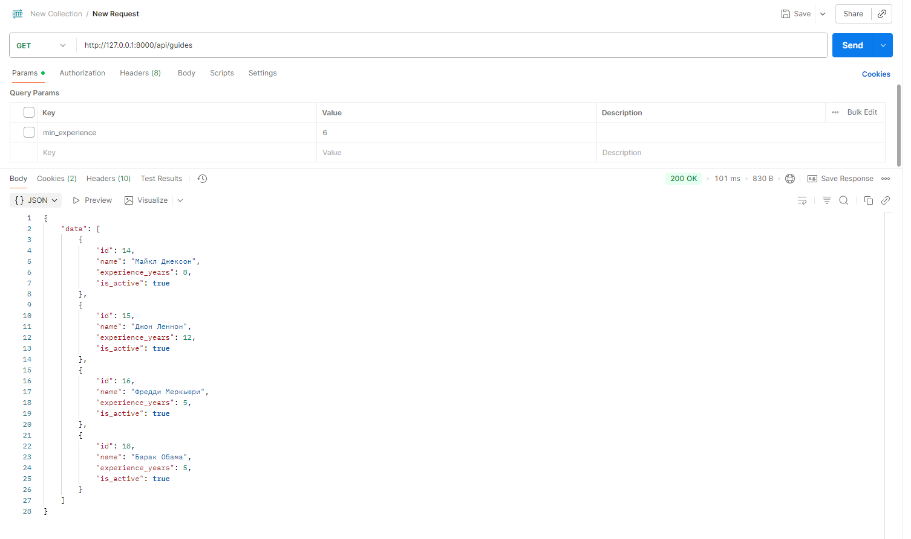
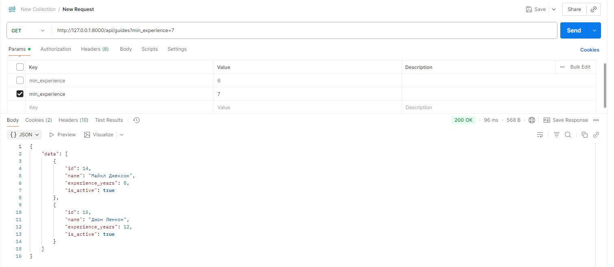
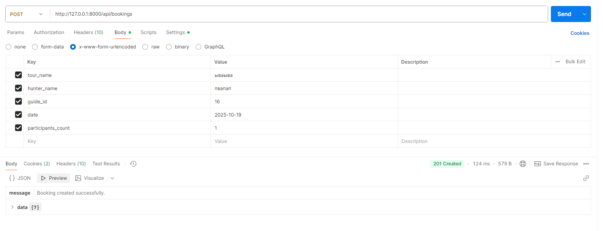
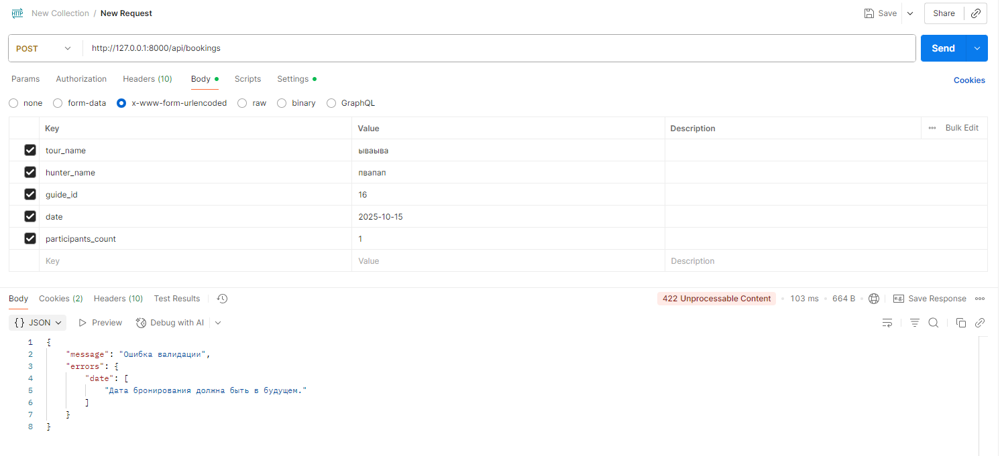

### Задание

Представь, что ты дорабатываешь ядро BookingCore. Нужно добавить простой функционал бронирования охотничьих туров с выбором гида.

Задача

Создать минимальный Laravel-модуль, который реализует:

Миграции и модели:
Guide (поля: name, experience_years, is_active)
HuntingBooking (поля: tour_name, hunter_name, guide_id, date, participants_count)
API-эндпоинты:
GET /api/guides — список активных гидов
POST /api/bookings — создание нового бронирования
Логика бронирования:
Проверить, что у выбранного гида нет других бронирований на ту же дату
Проверить, что participants_count <= 10
Вернуть осмысленные ответы (200, 400, 422 и т.д.)
Что оценивается

Корректность и чистота кода
Использование Laravel best practices (модели, валидация, контроллеры, ресурсы)
Структура проекта и понятность решений
Минимум «магии» — максимум логики
Бонус (по желанию)

Добавить простейший Unit/Feature-тест
Сделать фильтр GET /api/guides?min_experience=3
Коротко описать в README, как бы ты встроил это в BookingCore
Время выполнения

1–2 часа (в комфортном темпе).


### Развертывание

```
composer install
```
Заполнить актуальные данные в env
```
php artisan migrate
php artisan db:seed
```


### Фильтры
В идеале реализовать фильтр отдельным трейтом и обрабатывать там поочередно все поля, доступные для фитрации. Однако для задачи с единсственным полем достаточно и такой реализации.


### Тесты
Для примера прикреплюя скрины тестирования API через Postman

## Получение всех гидов


## Получение всех (с фильтрами)


## Успешная бронь


## Ошибка валидации (для примера взял прошедшую дату)

